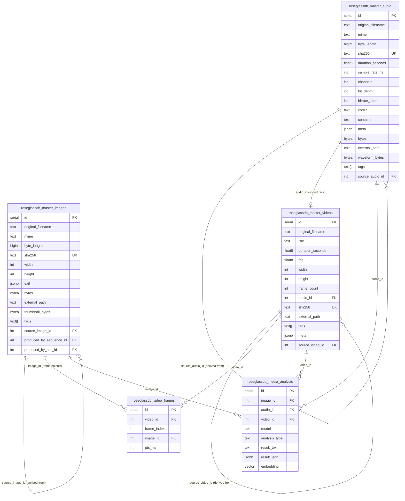
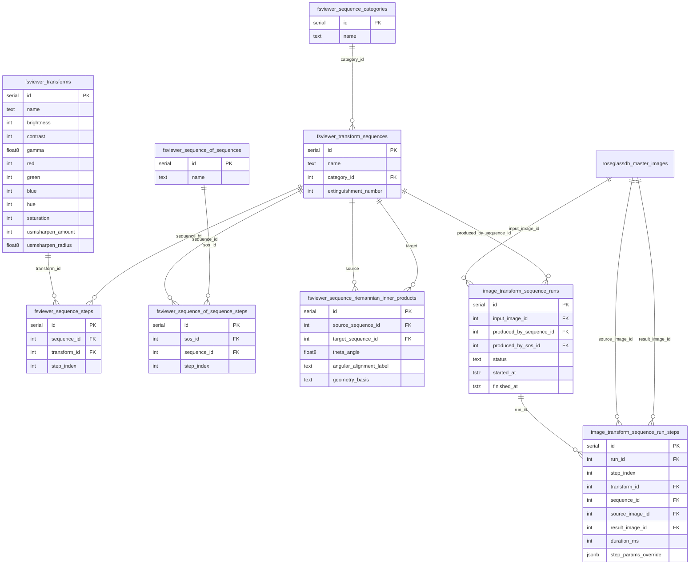
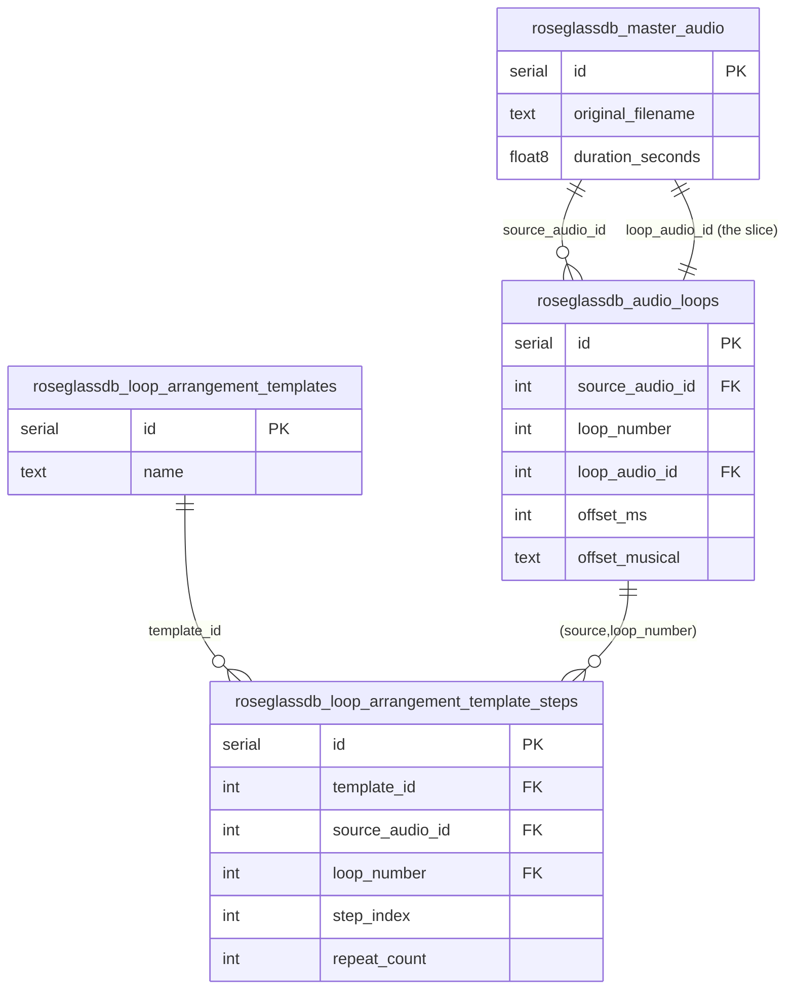
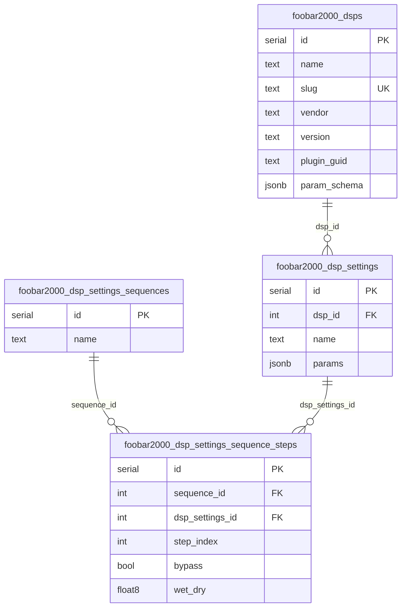

# Schema: roseglassdb core

Three subsystems share a common media layer. Read bottom-up: raw bytes go in, transforms/loops/DSP happen to them, analysis hangs off the results.

---

## 1 · Core media (the atoms)



### Video storage: why it's not 5000× the data

```
roseglassdb_master_videos  (1 row)
  id=7  fps=30  duration=60s  frame_count=1800  audio_id=3
  └─ audio_id → roseglassdb_master_audio id=3 (the soundtrack, stored once)

roseglassdb_video_frames  (1800 rows, ~36 KB total)
  video_id=7  frame_index=0    image_id=1001  pts_ms=0
  video_id=7  frame_index=1    image_id=1002  pts_ms=33
  video_id=7  frame_index=2    image_id=1002  pts_ms=67   ← same image_id! (duplicate frame)
  video_id=7  frame_index=3    image_id=1003  pts_ms=100
  ...

roseglassdb_master_images  (only unique frames stored)
  id=1001  sha256=abc…  bytes=<frame0 pixels>
  id=1002  sha256=def…  bytes=<frame1 pixels>   ← deduped: frames 1 and 2 point here
  id=1003  sha256=ghi…  bytes=<frame3 pixels>
```

Key insight: `roseglassdb_master_images` has `UNIQUE (sha256)`. Identical frames
(held frames, freeze-frames, repeated cuts) map to the same `image_id` in
`roseglassdb_video_frames`. The frame index is just integers — ~20 bytes per row.

---

## 2 · Image transform pipeline



A **transform** is a set of color/sharpen params applied to one image.
A **sequence** is an ordered list of transforms (steps).
A **sequence-of-sequences (SoS)** chains sequences together.
A **run** records what actually happened when you applied a sequence to an image — every intermediate result is stored as its own `master_images` row (linked back via `source_image_id`).

---

## 3 · Audio loop system



An `audio_loop` slices a source audio file at `offset_ms` and stores the resulting
clip as a new `master_audio` row (`loop_audio_id`). An arrangement template
sequences those loops with repeat counts.

---

## 4 · DSP chain (foobar2000)



---

## 5 · Analysis: what goes in `result_json`

### Image analysis

```json
{
  "objects":          ["mountain", "sky", "clouds", "treeline"],
  "scene":            "outdoor landscape",
  "dominant_colors":  ["#4a6fa5", "#e8c56d", "#2d3748"],
  "style":            "photorealistic",
  "composition":      "rule of thirds",
  "nsfw_score":       0.01
}
```

### Music / audio analysis

```json
{
  "bpm":              128.5,
  "key":              "F# minor",
  "time_signature":   "4/4",
  "energy":           0.87,
  "danceability":     0.72,
  "loudness_lufs":    -8.3,
  "mood":             ["dark", "energetic", "tense"],
  "genre":            ["electronic", "industrial", "techno"],
  "instruments":      ["synthesizer", "drum machine", "bass"],
  "segments": [
    { "start_ms": 0,     "end_ms": 32000, "label": "intro" },
    { "start_ms": 32000, "end_ms": 96000, "label": "verse" }
  ]
}
```

### Video analysis (whole-clip)

```json
{
  "scene_changes":    [0, 4200, 8100, 11500],
  "dominant_action":  "camera pan left",
  "avg_brightness":   142,
  "has_faces":        false,
  "motion_intensity": 0.34
}
```

---

## 6 · Vector search (`anythingllm_vectors` + `roseglassdb_media_analysis.embedding`)

You have two embedding surfaces:
- `anythingllm_vectors` — generic RAG vectors (content + metadata, not typed to a media entity)
- `roseglassdb_media_analysis.embedding` — typed to image / audio / video, queryable by `analysis_type`

The second one lets you do things like: *"find audio files whose embeddings are closest to this image's CLIP embedding"* by joining `media_analysis` on `image_id` or `audio_id` and using `<=>` cosine distance.

```sql
-- closest audio tracks to image id=42
SELECT a.id, a.original_filename, ia.embedding <=> img_emb.embedding AS dist
FROM roseglassdb_media_analysis img_emb
JOIN roseglassdb_media_analysis ia ON ia.audio_id IS NOT NULL
                                   AND ia.analysis_type = 'embedding'
WHERE img_emb.image_id = 42
  AND img_emb.analysis_type = 'embedding'
ORDER BY dist
LIMIT 10;
```
